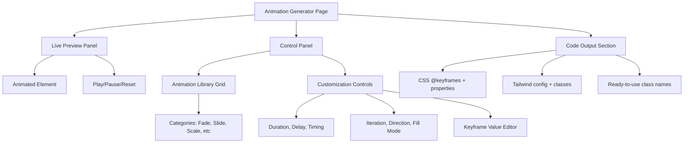

# CSS Animation Generator Tool

## Overview

Build a professional CSS Animation Generator that allows developers to preview, customize, and export popular CSS animations in multiple formats (CSS, Tailwind, and copy-paste classes).

## Architecture

The tool will follow the existing pattern established by other tools like [`gradient-generator`](src/app/\(tools)/tools/gradient-generator/page.tsx) and [`shadow-generator`](src/app/\(tools)/tools/shadow-generator/page.tsx).



## File Structure

### 1. Core Tool Files

- **[`src/app/(tools)/tools/css-animations/page.tsx`](src/app/\(tools)/tools/css-animations/page.tsx)** - Main tool page component
- **[`src/app/(tools)/tools/css-animations/layout.tsx`](src/app/\(tools)/tools/css-animations/layout.tsx)** - Metadata and SEO

### 2. Animation Library & Logic

- **[`src/lib/tools/animations/types.ts`](src/lib/tools/animations/types.ts)** - TypeScript interfaces for animations
- **[`src/lib/tools/animations/presets.ts`](src/lib/tools/animations/presets.ts)** - 30+ predefined animation presets organized by category
- **[`src/lib/tools/animations/generators.ts`](src/lib/tools/animations/generators.ts)** - Code generation functions for CSS, Tailwind, and classes
- **[`src/lib/tools/animations/index.ts`](src/lib/tools/animations/index.ts)** - Barrel export

### 3. UI Components

- **[`src/components/tools/css-animations/AnimationPreview.tsx`](src/components/tools/css-animations/AnimationPreview.tsx)** - Live preview with playback controls
- **[`src/components/tools/css-animations/AnimationLibrary.tsx`](src/components/tools/css-animations/AnimationLibrary.tsx)** - Grid of animation presets with categories
- **[`src/components/tools/css-animations/CustomizationPanel.tsx`](src/components/tools/css-animations/CustomizationPanel.tsx)** - All customization controls

## Animation Categories & Presets

### Categories (8 total)

1. **Fade** (fadeIn, fadeOut, fadeInUp, fadeInDown, fadeInLeft, fadeInRight)
2. **Slide** (slideInUp, slideInDown, slideInLeft, slideInRight, slideOutUp, slideOutDown)
3. **Scale** (scaleIn, scaleOut, scaleBounce, scaleRotate)
4. **Rotate** (rotate360, rotateIn, rotateOut, flip, flipX, flipY)
5. **Bounce** (bounce, bounceIn, bounceOut, bounceInDown, bounceInUp)
6. **Shake** (shake, shakeX, shakeY, wobble, swing)
7. **Attention** (pulse, heartbeat, flash, rubberBand, jello)
8. **Special** (glow, shimmer, glitch, typewriter, wave)

Total: 35+ animations

## Customization Controls

### Basic Properties

- **Duration**: 0.1s - 5s (slider)
- **Delay**: 0s - 3s (slider)
- **Timing Function**: Dropdown with presets (ease, linear, ease-in, ease-out, ease-in-out, cubic-bezier)

### Advanced Properties

- **Iteration Count**: 1, 2, 3, infinite (buttons + custom input)
- **Direction**: normal, reverse, alternate, alternate-reverse
- **Fill Mode**: none, forwards, backwards, both
- **Play State**: running, paused (for preview control)

### Keyframe Customization (Optional Advanced Feature)

- Allow editing specific keyframe percentages and transform values
- Show keyframe timeline visualization

## Output Formats

### 1. CSS Output

```css
@keyframes fadeInUp {
  from {
    opacity: 0;
    transform: translateY(24px);
  }
  to {
    opacity: 1;
    transform: translateY(0);
  }
}

.animate-fade-in-up {
  animation: fadeInUp 0.6s ease-out forwards;
}
```

### 2. Tailwind Config

```javascript
// tailwind.config.js
module.exports = {
  theme: {
    extend: {
      keyframes: {
        fadeInUp: {
          from: { opacity: '0', transform: 'translateY(24px)' },
          to: { opacity: '1', transform: 'translateY(0)' }
        }
      },
      animation: {
        'fade-in-up': 'fadeInUp 0.6s ease-out forwards'
      }
    }
  }
}
```

### 3. Ready-to-Use Classes

```html
<!-- Add to your HTML -->
<div class="animate-fade-in-up">Content</div>

<!-- Or with Tailwind arbitrary values -->
<div class="animate-[fadeInUp_0.6s_ease-out_forwards]">Content</div>
```

## Implementation Details

### Animation State Management

```typescript
interface AnimationConfig {
  id: string;
  name: string;
  category: AnimationCategory;
  keyframes: Keyframe[];
  duration: number; // in seconds
  delay: number;
  timingFunction: TimingFunction | string; // preset or custom cubic-bezier
  iterationCount: number | 'infinite';
  direction: AnimationDirection;
  fillMode: AnimationFillMode;
}

interface Keyframe {
  offset: number; // 0-100 percentage
  properties: Record<string, string>; // CSS properties
}
```

### Code Generation Strategy

- Use template literals for CSS generation
- Parse keyframes to generate Tailwind-compatible objects
- Provide both config-based and arbitrary value approaches for Tailwind
- Include helpful comments in generated code

## UI/UX Features

### Preview Panel

- Large preview box with animated element (customizable shape: box, circle, text)
- Play/Pause/Reset controls
- Loop toggle
- Preview background options (light/dark/gradient)

### Animation Library

- Category filter tabs (All, Fade, Slide, Scale, etc.)
- Search/filter by animation name
- Grid of animation cards with mini previews
- Hover to see animation in action

### Customization Panel

- Collapsible sections for Basic/Advanced/Keyframes
- Real-time preview updates
- Preset timing functions with visual bezier curves
- Copy individual properties

## Integration with Existing Codebase

### 1. Update [`src/config/tools.ts`](src/config/tools.ts)

Add new tool entry:

```typescript
{
  id: 'css-animations',
  name: 'CSS Animation Generator',
  description: 'Create and customize popular CSS animations with live preview. Export to CSS, Tailwind, or copy-paste classes.',
  category: 'css',
  path: '/tools/css-animations',
  icon: 'Sparkles',
  isNew: true,
  keywords: ['animation', 'css', 'keyframes', 'animate', 'transition', 'motion', 'effects'],
}
```

### 2. Add to [`src/lib/data/tool-content.ts`](src/lib/data/tool-content.ts)

Add "How to Use" steps and related tools:

- Related tools: `['gradient-generator', 'shadow-generator', 'tailwind-colors']`

### 3. Reuse Existing Components

- [`ToolLayout`](src/components/tools/shared/ToolLayout.tsx) for page structure
- [`CodeOutput`](src/components/tools/shared/CodeOutput.tsx) for code display
- [`TabSwitcher`](src/components/tools/shared/TabSwitcher.tsx) for output format tabs
- [`SliderInput`](src/components/tools/shared/SliderInput.tsx) for duration/delay controls
- [`CopyButton`](src/components/tools/shared/CopyButton.tsx) for copy functionality

## SEO & Metadata

### Keywords to Target

- css animation generator
- css keyframes generator
- animate css
- css animation library
- tailwind animation
- css effects generator
- animation code generator

### Structured Data

Include WebApplication schema with SoftwareApplication type, following pattern in [`ToolStructuredData`](src/components/tools/ToolStructuredData.tsx).

## Technical Considerations

### Performance

- Use CSS animations (not JS-based) for smooth 60fps performance
- Debounce control inputs to prevent excessive re-renders
- Memoize generated code strings
- Use `will-change` property appropriately in preview

### Accessibility

- Respect `prefers-reduced-motion` media query
- Provide option to disable animations in preview
- Include ARIA labels for all controls
- Keyboard navigation support

### Browser Compatibility

- Use vendor prefixes where necessary (-webkit-, -moz-)
- Test animations across browsers
- Provide fallbacks for older browsers

## Future Enhancements (Post-MVP)

1. **Animation Sequences** - Chain multiple animations
2. **Custom Keyframes** - Build animations from scratch
3. **Import/Export** - Save and load animation configs
4. **Animation Presets Library** - Community-contributed animations
5. **React/Vue Component Export** - Generate framework-specific code
6. **Timeline Editor** - Visual keyframe editing with timeline